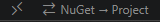
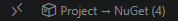

# NuGet Reference Switcher for VS Code

Switch between NuGet `PackageReference` and local `ProjectReference` in .NET projects — directly from VS Code.

## Features

- **Status bar button** — Single button in the VS Code status bar that dynamically switches between "NuGet → Project" and "Project → NuGet" based on current state
- **Auto-discovery** — Scans workspace for all `.csproj` files, matching NuGet packages to local projects by name, PackageId, or AssemblyName
- **Interactive picker** — Choose which references to switch via a multi-select QuickPick
- **Reversible** — Saves switch state in `.nugetswitch.json` sidecar files so you can cleanly revert
- **Auto-restore** — Optionally runs `dotnet restore` after switching
- **Additional search paths** — Configure directories outside the workspace to discover projects

## Requirements

- VS Code 1.85+
- .NET SDK installed (`dotnet` available in PATH)
- Projects should have been restored (`dotnet restore`) so `project.assets.json` exists

## Building the Extension

```bash
# Clone and install dependencies
git clone <repo-url>
cd vscode-nuget-switcher
npm install

# Compile TypeScript
npm run compile

# Watch mode (recompiles on save)
npm run watch
```

## Running in Development

1. Open the `vscode-nuget-switcher` folder in VS Code
2. Press **F5** — this launches an Extension Development Host
3. In the new VS Code window, open a folder/workspace containing `.csproj` files
4. Open the Command Palette (`Ctrl+Shift+P`) and run one of the commands below

## Packaging as a VSIX

```bash
# Install vsce if you haven't
npm install -g @vscode/vsce

# Package the extension
vsce package
```

This produces a `.vsix` file you can install via:  
`Extensions` → `...` → `Install from VSIX...`

## Status Bar Button

A single button is always visible in the bottom status bar while working in a `.csproj` workspace.

**Idle — no active switches:**



**Active — switches in place:**



| State | Button text | Action |
|-------|-------------|--------|
| No active switches | `⇄ NuGet → Project` | Opens the picker to switch PackageReferences to ProjectReferences |
| Switches active | `📦 Project → NuGet (N)` | Reverts all N switched references back to PackageReferences |

The button updates automatically when `.nugetswitch.json` files are created or deleted.

## Commands

All commands are also available via the Command Palette (`Ctrl+Shift+P`):

| Command | Description |
|---------|-------------|
| `NuGet Switcher: Switch to Project References` | Find PackageReferences that match local projects and replace them with ProjectReferences |
| `NuGet Switcher: Switch to Package References` | Revert all previously switched references back to PackageReferences |
| `NuGet Switcher: Show Switch Status` | Display all active switches in a Markdown preview |

## Configuration

Add to your `.vscode/settings.json` or user settings:

```jsonc
{
  // Directories outside the workspace to search for .csproj files
  "nugetSwitcher.additionalSearchPaths": [
    "C:/repos/shared-libraries",
    "D:/projects/my-framework"
  ],

  // Run dotnet restore after switching (default: true)
  "nugetSwitcher.autoRestore": true,

  // Glob patterns to exclude from project discovery
  "nugetSwitcher.excludePatterns": [
    "**/node_modules/**",
    "**/bin/**",
    "**/obj/**"
  ]
}
```

## How It Works

### Switching to Project References

1. Extension scans the workspace (and `additionalSearchPaths`) for all `.csproj` files
2. For each project, reads its `PackageReference` entries
3. Matches package names against discovered local projects (by project name, `<PackageId>`, or `<AssemblyName>`)
4. Shows you a picker with all switchable references
5. Replaces `<PackageReference Include="X" Version="1.0.0" />` with `<ProjectReference Include="../path/to/X.csproj" />`
6. Saves the original state in a `ProjectName.nugetswitch.json` sidecar file

### Reverting to Package References

1. Finds all `.nugetswitch.json` manifest files in the workspace
2. For each recorded switch, replaces the `ProjectReference` back with the original `PackageReference` (including version)
3. Deletes the manifest file after successful revert

### Sidecar File Format

```json
{
  "switchedAt": "2026-05-04T12:00:00.000Z",
  "sourceProject": "C:/repos/app/MyApp/MyApp.csproj",
  "switches": [
    {
      "packageId": "MyLibrary",
      "version": "2.1.0",
      "projectPath": "../../MyLibrary/MyLibrary.csproj"
    }
  ]
}
```

## Tips

- Add `*.nugetswitch.json` to your `.gitignore` — these are local development files
- Use a [multi-root workspace](https://code.visualstudio.com/docs/editor/multi-root-workspaces) (`.code-workspace` file) to have all your library projects visible alongside your app
- Install the **C# Dev Kit** extension for a Solution Explorer view that shows all projects in your `.sln`

## License

MIT
